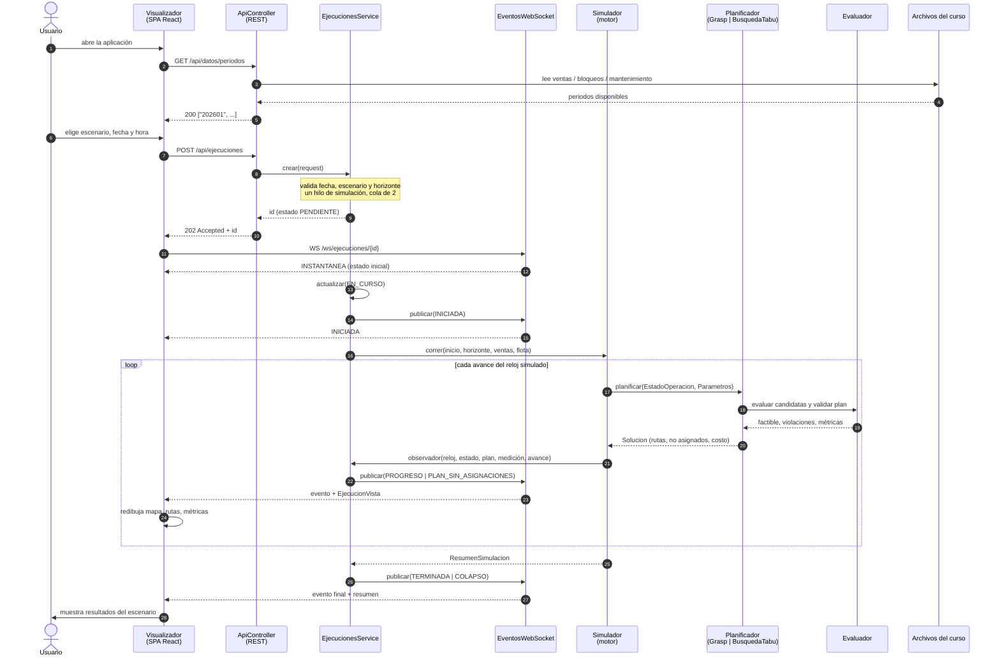
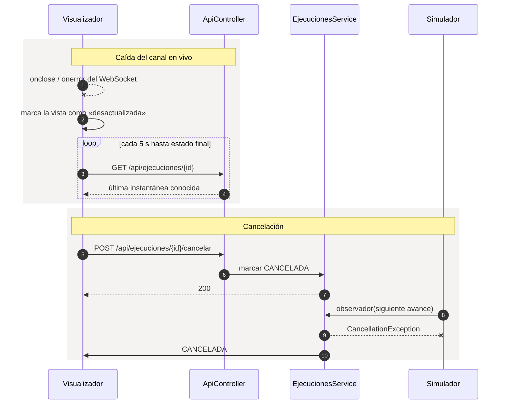

# Interacción Planificador – Visualizador

Equipo 2B · 1INF54 · Semana 8

Este diagrama describe **la interacción tal como está implementada** en
`backend/src/main/java/com/paqrap/api` y `frontend/src/`, no la arquitectura propuesta en
`26.dis.arquitectura.solucion.v2`. Las dos difieren en un punto: el documento describe dos
JAR independientes (`paqrap-grasp_v02.jar` y `paqrap-tabu_v02.jar`) que el Servicio
planificador elige en tiempo de ejecución; el código tiene un solo módulo `codigo/paqrap`
del que `EjecucionesService` instancia `Grasp` o `BusquedaTabu` directamente.

## Quién es quién

| Elemento del diseño | Clase o archivo real |
| --- | --- |
| Visualizador | SPA React: `frontend/src/App.jsx` y sus pantallas |
| Servicio de aplicación | `ApiController` (REST) |
| Motor de simulación | `Simulador` (`com.paqrap.simulacion`) |
| Servicio planificador | `EjecucionesService` |
| Planificador | `Grasp` o `BusquedaTabu`, ambos implementan `Planificador` |
| Evaluador común | `Evaluador` |
| Canal en vivo | `EjecucionWebSocketHandler` + `EventosWebSocket` |
| Almacenamiento | archivos del curso, vía `DatosService` |

El Visualizador y el Perfil de planificación no son procesos separados: se sirven dentro de
la misma SPA, como ya aclara `26.dis.arquitectura.solucion.v2` §3.

## Secuencia principal

## Qué pasa cuando algo se corta

El reloj simulado (`reloj`) y el tiempo real de cómputo (`actualizadoEn`) viajan por separado
en cada `EjecucionVista`, de modo que el Visualizador los puede distinguir en todo momento,
como exige `25.dis.gui.v2` §1.

## Lo que el Planificador no recibe del Visualizador

Vale la pena dejarlo escrito porque delimita la interacción: el Visualizador **solo** puede
crear, consultar y cancelar una ejecución. No registra pedidos, no reporta averías, no sube
archivos y no modifica un plan en curso. La API no tiene endpoints de escritura sobre el
dominio, de modo que no existe un camino por el que la interfaz pueda alterar una corrida en
marcha más allá de cancelarla.
